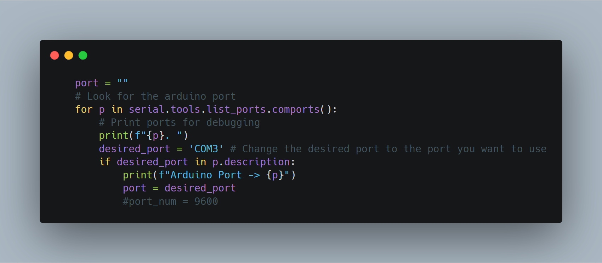
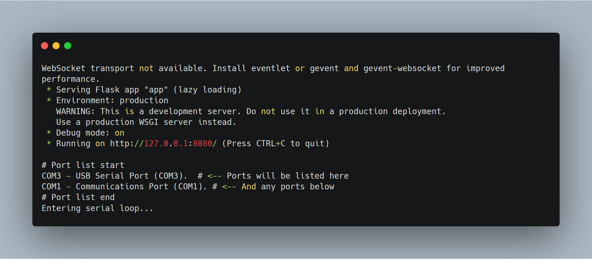

# Documentation for the [backend](https://github.com/SagnikPradhan/the-knights/tree/b40225d6ca580323436ecf3f953cbdaf4bd8ebc1/backend):
## Contents:
Contents: | Description:
-------- | -----------
[Running](https://github.com/SagnikPradhan/the-knights/tree/b40225d6ca580323436ecf3f953cbdaf4bd8ebc1/backend#running) | Describes how to run the server
[JSON Data format](https://github.com/SagnikPradhan/the-knights/tree/b40225d6ca580323436ecf3f953cbdaf4bd8ebc1/backend#json-data-format) | Describes how JSON files should be formatted
[Manually finding ports](https://github.com/SagnikPradhan/the-knights/tree/b40225d6ca580323436ecf3f953cbdaf4bd8ebc1/backend#manually-finding-ports) | Describes how to manually find ports if the server can't
[Deployment](https://github.com/SagnikPradhan/the-knights/tree/b40225d6ca580323436ecf3f953cbdaf4bd8ebc1/backend#deployment) | Describes various options on how to deploy the server

## Running:
Since this is a Flask app, it can be run using:

Either -> 
```bash
flask run
```
Or ->
```bash
python -m flask
```
> Note: If running for production do not use the default Flask servers, go to the Deployment section for extra help with that

## JSON Data format:
Data from the LED's should be formatted like this:
```py
example_json = [
    "leds": {
        # LED's should be numbered 1..end
        0: [r, g, b]
        }
]
```
> Note: Subject to change

## Manually finding ports:
- Run the server
  - Go to the section about running the server to see how
- Check output of ports
- Look for your port:
  - eg. "Arduino", "COM1", "/dev/tts"
- Edit the below code as commented:
> Run the program, check output:

> How to find the ports:
>
>

> Note: This step is not required as it is configured to automatically find ports, only use if port can not be found

## Deployment:
There are many different options to deploy a Flask app, some of the various options can be found [here](https://flask.palletsprojects.com/en/1.1.x/deploying/), since that website covers the many different deployment options quite nicely, there is no need to cover them here.

While lightweight and easy to use, Flask’s built-in server is not suitable for production as it doesn’t scale well.
> Note: This step is only required if you are deploying this for production
